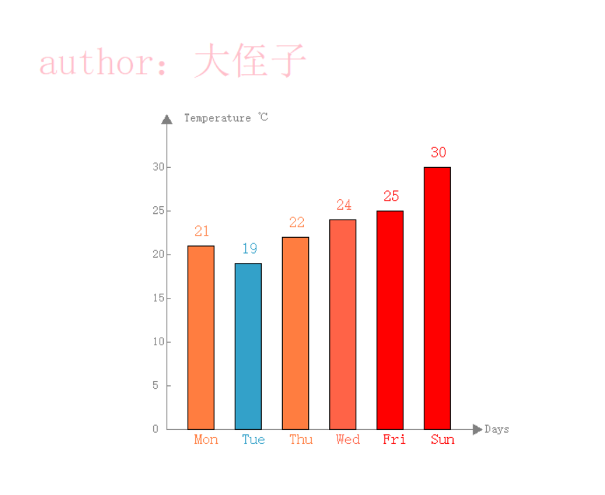
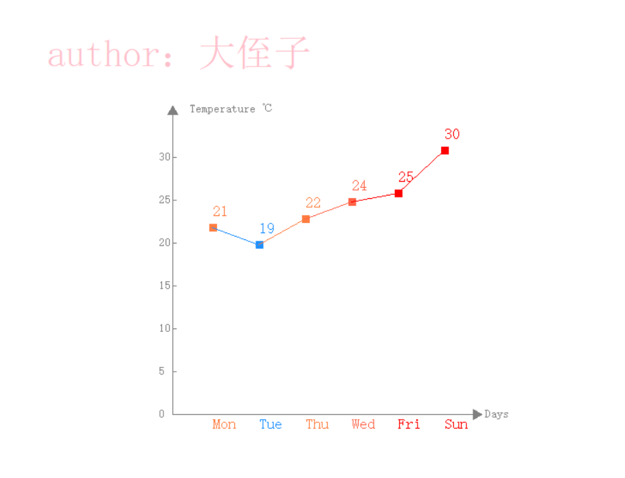
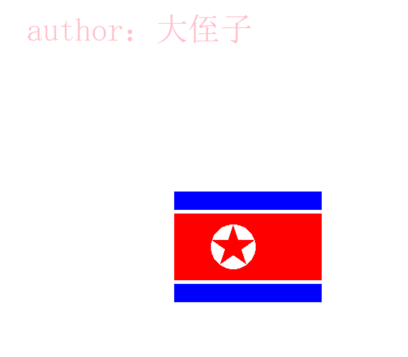
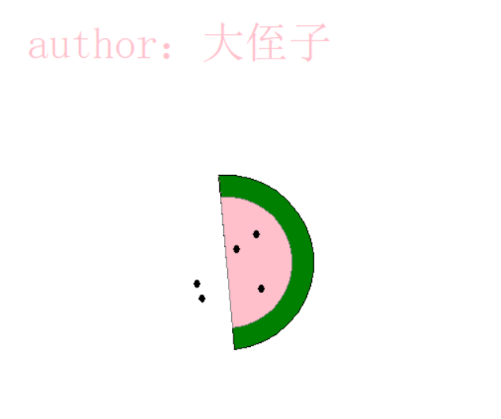
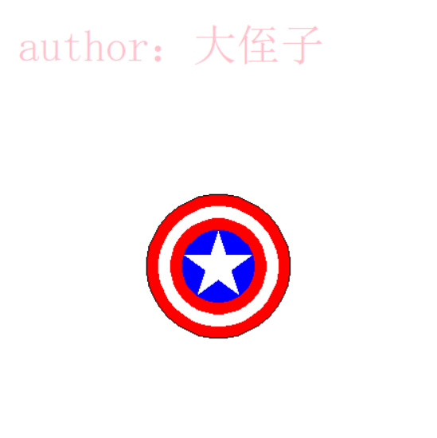

# bar_line_charts and flags

>  柱形图 折线图 和 旗子

### 1. bar_line_charts 项目截图：

####  bar_charts：

 
 
####  line_charts：

### 2. bar_line_charts 思路
- 图：
    - 柱形图：
        - 坐标轴：
            
            - x 轴：
                - 箭头（三角形）
                - 刻度
                - 文本信息
            - y 轴：
                -  箭头（三角形）
                - 刻度
                - 文本信息
                
        - rects:
             - rect:
                  - 高度 （temp 温度）
                    - 宽度  （默认 30px）
                    - 颜色 ：
                        - 边缘
                        - 填充
                - 文本信息
                   
    - 折线图：
        - 坐标轴：
            
            - x 轴
                 - 箭头（三角形）
                 - 刻度
                 - 文本信息
             - y 轴：
                 - 箭头（三角形）
                 - 刻度
                 - 文本信息
        - lines:
            
            - line:
                
                - point:
                     - x 坐标
                     - y 坐标
                     - 颜色
                - 文本信息
                - square:
                     - 中心 x 坐标
                     - 中心 y 坐标
                     - 颜色
 
 
 
 ## 3. 其他项目截图：
 
####  northkorea：

###  northkorea 思路
- northkorea
    - reacts
        - w 一样
        - h space 比例不一样
        - color 颜色
    - circle and star
        - 中心 circle
            - x
            - y
            - r
            - color
        - 中心 star
            - x
            - y
            - r
            - color
 
####  gua：

###  gua 思路
- gua
    - gua_skin 瓜皮
        - semicircle 半圆
            - fan 扇形
    - gua_meat 瓜肉
        - semicircle 半圆
            - fan 扇形
    - gua_seeds 瓜子
        - seed 
            - ellipse 椭圆
         
####  sheild 美国队长盾牌：

### sheild 思路：
- sheild
    - circles
        - circle
            - x
            - y
            - space 所占比例
            - color
         
            
####  china：

### china 思路：
- china
    - rect
        - w
        - h
        - x
        - y
        - color
         
    - pentas
        - penta
            - big_penta
                - w
                - h
                - x
                - y
                - color
            - small_pentas
                - small_penta
                    - w
                    - h
                    - x
                    - y
                    - space
                    - color
             
####  france：

####  germany：

####  gambia：

####  switzerland：

